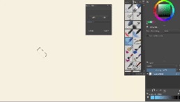

# Krita Potter's Wheel Plugin

## Overview

You might have seen those videos of artists painting onto spinning pottery wheels. This plugin rotates the canvas continuously, allowing you to achieve the same effect.

## Installation

Like most Krita plugins, either download the zip directly from gitHub [here](https://github.com/RainbowPangolin/kritapotterswheel/raw/main/potterywheel.zip) and use Krita's Script Importer Plugin (Tools > Scripts > Import Python Plugin From File...), or copy the contents of this repo's `src` directory (a folder and a .desktop file) into your `C:\Users\[USER]\AppData\Roaming\krita\pykrita` directory. Restart to load the plugin.

## FAQ

- How does this work?
  - This plugin creates a docker which hastwo buttons to start and stop the rotation, and a slider to change the speed of the rotation. When you press start, the canvas immediately starts rotating, and you can draw onto the spinning canvas.

## Known issues

- My lines are jittery
  - Due to the way the plugin currently works (using Krita's inbuilt rotation system to rotate a tiny amount every few milliseconds), this is unavoidable. **Use the brush stabilizer to smooth out the lines.** Unfortunately, this introduces noticable input delay due to how the stabilizer works. I'm experimenting on a solution to make raw inputs nicer, but it will depend on demand for the plugin.
- Mouse input doesn't work well
  - This is just due to how Krita samples mouse inputs vs tablet inputs. I'll work on making mouse inputs better if there is demand for it. 

## Misc

[Report Issues](https://github.com/RainbowPangolin/kritapotterswheel/issues)
